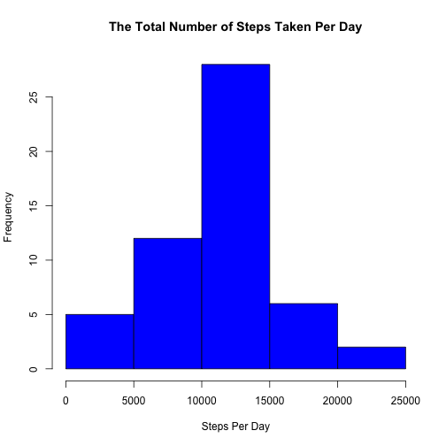
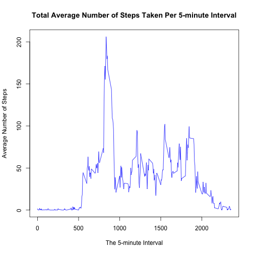
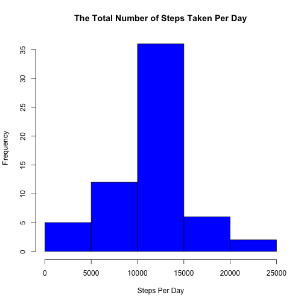
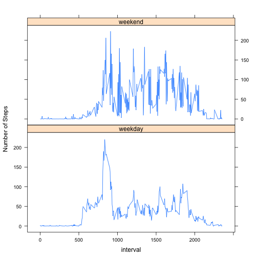

Complete the entire assignment in a single R markdown document that can be processed by knitr and be transformed into an HTML file.

Load and preprocess the data about personal movement:


```r
fitness <- read.csv("activity.csv")
summary(fitness)
```

```
##      steps                date          interval     
##  Min.   :  0.00   2012-10-01:  288   Min.   :   0.0  
##  1st Qu.:  0.00   2012-10-02:  288   1st Qu.: 588.8  
##  Median :  0.00   2012-10-03:  288   Median :1177.5  
##  Mean   : 37.38   2012-10-04:  288   Mean   :1177.5  
##  3rd Qu.: 12.00   2012-10-05:  288   3rd Qu.:1766.2  
##  Max.   :806.00   2012-10-06:  288   Max.   :2355.0  
##  NA's   :2304     (Other)   :15840
```

A histogram on the total number of steps taken per day:

```r
stepsPerDay <- aggregate(steps ~ date, data = fitness, FUN = sum, na.rm = TRUE)
hist(stepsPerDay$steps, main = "The Total Number of Steps Taken Per Day",
     xlab = "Steps Per Day", col = "blue")
```

 

Summary of mean total number of steps taken per day:  
Mean:

```r
mean(stepsPerDay$steps)
```

```
## [1] 10766.19
```

Median:

```r
median(stepsPerDay$steps)
```

```
## [1] 10765
```
  
A time series plot (i.e. type = "l") of the 5-minute interval (x-axis) and the average number of steps taken, averaged across all days (y-axis):

```r
PerInterval <- aggregate(steps ~ interval, data = fitness, FUN = mean, na.rm = TRUE)
plot(x = PerInterval$interval, y = PerInterval$steps, 
     type = "l", col = "blue",
     xlab ="The 5-minute Interval", ylab = "Average Number of Steps",
     main = "Total Average Number of Steps Taken Per 5-minute Interval")
```

 
  
The 5-minute interval that contains the maximum number of steps is

```r
PerInterval[PerInterval$steps == max(PerInterval$steps),1]
```

```
## [1] 835
```


**Imputing missing values**

The total number of missing values in the dataset 

```r
sum(is.na(fitness))
```

```
## [1] 2304
```

Fiiling in all of the missing values in the dataset with the mean number of steps of the 5-minute interval using the calculated mean stored in data frame IntervalPerDay. Below is the function to perform the task.


```r
fillNA <- function(IntervalPerDay, interval){
    newsteps <- IntervalPerDay[IntervalPerDay$interval == interval,2]
}
```

Create a new dataset that is equal to the original dataset but with the missing data filled in.

```r
filledfitness <- fitness

NAIndex <- which(is.na(filledfitness$steps))
for(i in NAIndex) {
    filledfitness[i,1] <- fillNA(PerInterval,filledfitness[i,3])    
}
summary(filledfitness)
```

```
##      steps                date          interval     
##  Min.   :  0.00   2012-10-01:  288   Min.   :   0.0  
##  1st Qu.:  0.00   2012-10-02:  288   1st Qu.: 588.8  
##  Median :  0.00   2012-10-03:  288   Median :1177.5  
##  Mean   : 37.38   2012-10-04:  288   Mean   :1177.5  
##  3rd Qu.: 27.00   2012-10-05:  288   3rd Qu.:1766.2  
##  Max.   :806.00   2012-10-06:  288   Max.   :2355.0  
##                   (Other)   :15840
```

A histogram on the total number of steps taken per day of the imputed dataset:

```r
fstepsPerDay <- aggregate(steps ~ date, data = filledfitness, FUN = sum, na.rm = TRUE)
hist(fstepsPerDay$steps, main = "The Total Number of Steps Taken Per Day",
     xlab = "Steps Per Day", col = "blue")
```

 

Summary of mean total number of steps taken per day:  
Mean:

```r
mean(fstepsPerDay$steps)
```

```
## [1] 10766.19
```

Median:

```r
median(fstepsPerDay$steps)
```

```
## [1] 10766.19
```

Do these values differ from the estimates from the first part of the assignment?  
When comparing the values between the original dataset and the imputed dataset, the mean is the same while the median from the original data is slighted less than the imputed dataset.  

What is the impact of imputing missing data on the estimates of the total daily number of steps?  
The total daily number of steps increased in the imputed dataset.  

**Are there differences in activity patterns between weekdays and weekends?**
  
Create a new factor variable "filledfitness$week" in the dataset with two levels – “weekday” and “weekend” indicating whether a given date is a weekday or weekend day.  

```r
filledfitness$date <- as.Date(filledfitness$date)
filledfitness$week <- ifelse((weekdays(filledfitness$date)==c("Saturday","Sunday")),
                             "weekend","weekday")
filledfitness$week <- as.factor(filledfitness$week)
str(filledfitness)
```

```
## 'data.frame':	17568 obs. of  4 variables:
##  $ steps   : num  1.717 0.3396 0.1321 0.1509 0.0755 ...
##  $ date    : Date, format: "2012-10-01" "2012-10-01" ...
##  $ interval: int  0 5 10 15 20 25 30 35 40 45 ...
##  $ week    : Factor w/ 2 levels "weekday","weekend": 1 1 1 1 1 1 1 1 1 1 ...
```

Make a panel plot containing a time series plot (i.e. type = "l") of the 5-minute interval (x-axis) and the average number of steps taken, averaged across all weekday days or weekend days (y-axis). 


```r
require(lattice)
fPerInt <- aggregate(steps ~ interval * week, data = filledfitness ,FUN = mean, na.rm = TRUE)
xyplot(steps ~ interval | week, data = fPerInt,
       layout=c(1,2), type = 'l', ylab = "Number of Steps")
```

 
